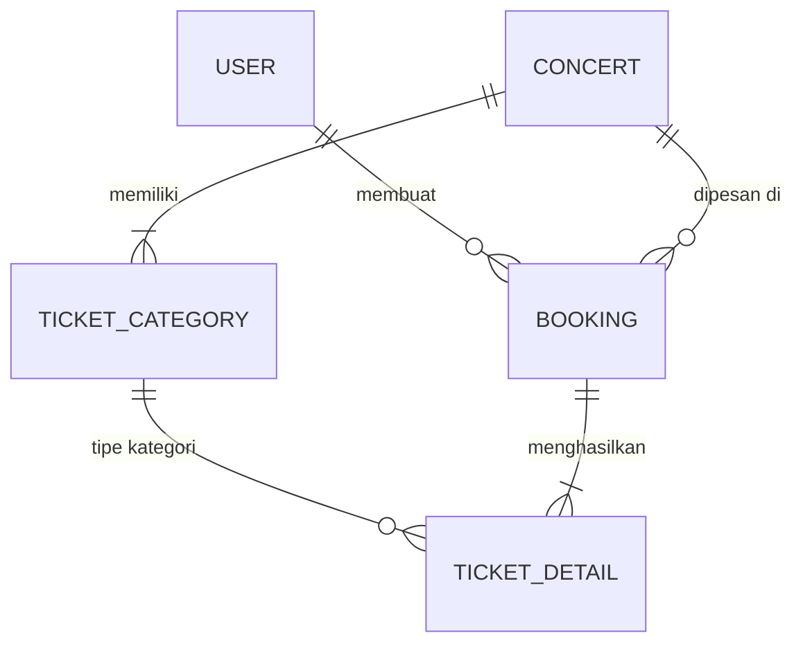

# Dokumen Kebutuhan Tabel Sistem Tiket Konser

Dokumen ini menjelaskan rancangan database (skema tabel) yang dibutuhkan untuk membangun **Sistem Pemesanan Tiket Konser**. Rancangan ini disesuaikan dengan penggunaan **Golang ORM (GORM)** dan database **PostgreSQL**.

---

## 1. Arsitektur Relasi Tabel (ERD)

Berikut adalah diagram relasi antar tabel (Entity Relationship Diagram) yang digunakan dalam sistem tiket konser:



---

## 2. Kebutuhan & Spesifikasi Tabel

Setiap tabel dirancang menggunakan standard field GORM (`ID`, `CreatedAt`, `UpdatedAt`, `DeletedAt` untuk Soft Delete).

### A. Tabel `users`
Tabel ini digunakan untuk menyimpan data pengguna sistem, baik pelanggan (customer) maupun administrator.

| Nama Kolom | Tipe Data (PostgreSQL) | Atribut / Constraint | Deskripsi |
| :--- | :--- | :--- | :--- |
| `id` | SERIAL / BIGINT | PRIMARY KEY, AUTO INCREMENT | ID unik pengguna |
| `name` | VARCHAR(100) | NOT NULL | Nama lengkap pengguna |
| `email` | VARCHAR(150) | UNIQUE, NOT NULL | Alamat email (untuk login & e-ticket) |
| `password` | VARCHAR(255) | NOT NULL | Password yang sudah di-hash (bcrypt) |
| `phone` | VARCHAR(20) | NULL | Nomor telepon pengguna |
| `role` | VARCHAR(20) | DEFAULT 'customer' | Role pengguna: `admin` atau `customer` |
| `created_at` | TIMESTAMP WITH TIME ZONE | | Waktu data dibuat |
| `updated_at` | TIMESTAMP WITH TIME ZONE | | Waktu data diperbarui |
| `deleted_at` | TIMESTAMP WITH TIME ZONE | INDEX | Waktu data dihapus (Soft Delete) |

### B. Tabel `concerts`
Tabel ini menyimpan informasi dasar mengenai konser/event musik yang diselenggarakan.

| Nama Kolom | Tipe Data (PostgreSQL) | Atribut / Constraint | Deskripsi |
| :--- | :--- | :--- | :--- |
| `id` | SERIAL / BIGINT | PRIMARY KEY, AUTO INCREMENT | ID unik konser |
| `title` | VARCHAR(150) | NOT NULL | Nama/Judul konser |
| `description` | TEXT | NULL | Deskripsi detail konser |
| `date` | TIMESTAMP WITH TIME ZONE | NOT NULL | Tanggal & waktu pelaksanaan konser |
| `venue` | VARCHAR(200) | NOT NULL | Lokasi/Tempat konser berlangsung |
| `status` | VARCHAR(20) | DEFAULT 'active' | Status konser: `draft`, `active`, `completed`, `cancelled` |
| `created_at` | TIMESTAMP WITH TIME ZONE | | Waktu data dibuat |
| `updated_at` | TIMESTAMP WITH TIME ZONE | | Waktu data diperbarui |
| `deleted_at` | TIMESTAMP WITH TIME ZONE | INDEX | Waktu data dihapus (Soft Delete) |

### C. Tabel `ticket_categories`
Tabel ini mendefinisikan kelas atau kategori tiket yang tersedia untuk setiap konser beserta harganya.

| Nama Kolom | Tipe Data (PostgreSQL) | Atribut / Constraint | Deskripsi |
| :--- | :--- | :--- | :--- |
| `id` | SERIAL / BIGINT | PRIMARY KEY, AUTO INCREMENT | ID unik kategori tiket |
| `concert_id` | BIGINT | FOREIGN KEY (`concerts.id`) | Relasi ke tabel konser |
| `name` | VARCHAR(50) | NOT NULL | Nama kelas tiket (e.g., `VIP`, `Festival`, `CAT 1`) |
| `price` | NUMERIC(12, 2) | NOT NULL | Harga per tiket |
| `total_quota` | INTEGER | NOT NULL | Jumlah total kuota awal |
| `available_quota` | INTEGER | NOT NULL | Sisa kuota tiket yang tersedia |
| `created_at` | TIMESTAMP WITH TIME ZONE | | Waktu data dibuat |
| `updated_at` | TIMESTAMP WITH TIME ZONE | | Waktu data diperbarui |
| `deleted_at` | TIMESTAMP WITH TIME ZONE | INDEX | Waktu data dihapus (Soft Delete) |

### D. Tabel `bookings`
Tabel transaksi utama yang mencatat pesanan tiket oleh pelanggan.

| Nama Kolom | Tipe Data (PostgreSQL) | Atribut / Constraint | Deskripsi |
| :--- | :--- | :--- | :--- |
| `id` | SERIAL / BIGINT | PRIMARY KEY, AUTO INCREMENT | ID unik booking |
| `booking_code` | VARCHAR(50) | UNIQUE, NOT NULL | Kode transaksi unik (e.g., `TKT-20260622-001`) |
| `user_id` | BIGINT | FOREIGN KEY (`users.id`) | Pengguna yang melakukan pemesanan |
| `concert_id` | BIGINT | FOREIGN KEY (`concerts.id`) | Konser yang dipesan |
| `total_amount` | NUMERIC(12, 2) | NOT NULL | Total nominal pembayaran |
| `status` | VARCHAR(20) | DEFAULT 'pending' | Status booking: `pending`, `paid`, `expired`, `cancelled` |
| `payment_method` | VARCHAR(50) | NULL | Metode pembayaran (e.g., `GoPay`, `Virtual Account`) |
| `booking_date` | TIMESTAMP WITH TIME ZONE | DEFAULT CURRENT_TIMESTAMP | Waktu pemesanan dibuat |
| `created_at` | TIMESTAMP WITH TIME ZONE | | Waktu data dibuat |
| `updated_at` | TIMESTAMP WITH TIME ZONE | | Waktu data diperbarui |
| `deleted_at` | TIMESTAMP WITH TIME ZONE | INDEX | Waktu data dihapus (Soft Delete) |

### E. Tabel `ticket_details` (E-Ticket / Barcode)
Tabel detail tiket fisik/e-ticket yang diterbitkan setelah transaksi berstatus `paid`. Setiap baris merepresentasikan 1 lembar tiket fisik.

| Nama Kolom | Tipe Data (PostgreSQL) | Atribut / Constraint | Deskripsi |
| :--- | :--- | :--- | :--- |
| `id` | SERIAL / BIGINT | PRIMARY KEY, AUTO INCREMENT | ID unik tiket |
| `booking_id` | BIGINT | FOREIGN KEY (`bookings.id`) | Terikat ke transaksi pembelian |
| `ticket_category_id` | BIGINT | FOREIGN KEY (`ticket_categories.id`) | Kategori kelas tiket |
| `ticket_code` | VARCHAR(100) | UNIQUE, NOT NULL | Kode unik tiket / QR Code (e.g., `ETC-88912-990`) |
| `holder_name` | VARCHAR(100) | NOT NULL | Nama pengunjung konser yang tertera di tiket |
| `holder_identity_no` | VARCHAR(50) | NOT NULL | Nomor ID (KTP / SIM / Passport) pemilik tiket |
| `is_used` | BOOLEAN | DEFAULT FALSE | Status kehadiran / check-in di lokasi konser |
| `created_at` | TIMESTAMP WITH TIME ZONE | | Waktu data dibuat |
| `updated_at` | TIMESTAMP WITH TIME ZONE | | Waktu data diperbarui |
| `deleted_at` | TIMESTAMP WITH TIME ZONE | INDEX | Waktu data dihapus (Soft Delete) |

---

## 3. Implementasi Struct Model di Golang (GORM)

Anda dapat mengimplementasikan skema tabel di atas ke dalam kode Golang menggunakan library `gorm` sebagai berikut:

```go
package models

import (
	"time"

	"gorm.io/gorm"
)

// User represents the users table
type User struct {
	ID        uint           `gorm:"primaryKey" json:"id"`
	Name      string         `gorm:"type:varchar(100);not null" json:"name"`
	Email     string         `gorm:"type:varchar(150);unique;not null" json:"email"`
	Password  string         `gorm:"type:varchar(255);not null" json:"-"` // Hide password in JSON responses
	Phone     string         `gorm:"type:varchar(20)" json:"phone"`
	Role      string         `gorm:"type:varchar(20);default:'customer'" json:"role"`
	Bookings  []Booking      `gorm:"foreignKey:UserID" json:"bookings,omitempty"`
	CreatedAt time.Time      `json:"created_at"`
	UpdatedAt time.Time      `json:"updated_at"`
	DeletedAt gorm.DeletedAt `gorm:"index" json:"-"`
}

// Concert represents the concerts table
type Concert struct {
	ID               uint             `gorm:"primaryKey" json:"id"`
	Title            string           `gorm:"type:varchar(150);not null" json:"title"`
	Description      string           `gorm:"type:text" json:"description"`
	Date             time.Time        `gorm:"not null" json:"date"`
	Venue            string           `gorm:"type:varchar(200);not null" json:"venue"`
	Status           string           `gorm:"type:varchar(20);default:'active'" json:"status"`
	TicketCategories []TicketCategory `gorm:"foreignKey:ConcertID" json:"ticket_categories,omitempty"`
	CreatedAt        time.Time        `json:"created_at"`
	UpdatedAt        time.Time        `json:"updated_at"`
	DeletedAt        gorm.DeletedAt   `gorm:"index" json:"-"`
}

// TicketCategory represents the ticket_categories table
type TicketCategory struct {
	ID             uint           `gorm:"primaryKey" json:"id"`
	ConcertID      uint           `gorm:"not null" json:"concert_id"`
	Name           string         `gorm:"type:varchar(50);not null" json:"name"`
	Price          float64        `gorm:"type:numeric(12,2);not null" json:"price"`
	TotalQuota     int            `gorm:"not null" json:"total_quota"`
	AvailableQuota int            `gorm:"not null" json:"available_quota"`
	CreatedAt      time.Time      `json:"created_at"`
	UpdatedAt      time.Time      `json:"updated_at"`
	DeletedAt      gorm.DeletedAt `gorm:"index" json:"-"`
}

// Booking represents the bookings table
type Booking struct {
	ID            uint           `gorm:"primaryKey" json:"id"`
	BookingCode   string         `gorm:"type:varchar(50);unique;not null" json:"booking_code"`
	UserID        uint           `gorm:"not null" json:"user_id"`
	ConcertID     uint           `gorm:"not null" json:"concert_id"`
	TotalAmount   float64        `gorm:"type:numeric(12,2);not null" json:"total_amount"`
	Status        string         `gorm:"type:varchar(20);default:'pending'" json:"status"`
	PaymentMethod string         `gorm:"type:varchar(50)" json:"payment_method"`
	BookingDate   time.Time      `gorm:"default:CURRENT_TIMESTAMP" json:"booking_date"`
	TicketDetails []TicketDetail `gorm:"foreignKey:BookingID" json:"ticket_details,omitempty"`
	CreatedAt     time.Time      `json:"created_at"`
	UpdatedAt     time.Time      `json:"updated_at"`
	DeletedAt     gorm.DeletedAt `gorm:"index" json:"-"`
}

// TicketDetail represents the ticket_details table (E-Tickets)
type TicketDetail struct {
	ID               uint           `gorm:"primaryKey" json:"id"`
	BookingID        uint           `gorm:"not null" json:"booking_id"`
	TicketCategoryID uint           `gorm:"not null" json:"ticket_category_id"`
	TicketCode       string         `gorm:"type:varchar(100);unique;not null" json:"ticket_code"`
	HolderName       string         `gorm:"type:varchar(100);not null" json:"holder_name"`
	HolderIdentityNo string         `gorm:"type:varchar(50);not null" json:"holder_identity_no"`
	IsUsed           bool           `gorm:"default:false" json:"is_used"`
	CreatedAt        time.Time      `json:"created_at"`
	UpdatedAt        time.Time      `json:"updated_at"`
	DeletedAt        gorm.DeletedAt `gorm:"index" json:"-"`
}
```

---

## 4. Alur Transaksi & Validasi Data (Business Logic Considerations)

Untuk menjaga integritas data tiket, pastikan aplikasi Anda melakukan penanganan berikut saat memproses booking baru:

1. **Database Transaction (`db.Begin()`)**: 
   Pembelian tiket sangat rentan terhadap *race condition*. Pastikan pengurangan `available_quota` di tabel `ticket_categories` dan pembuatan record baru di `bookings` dibungkus dalam sebuah database transaction.
2. **Pengecekan Kuota**:
   Sebelum memproses transaksi, lakukan validasi apakah `available_quota` lebih besar atau sama dengan jumlah tiket yang dipesan.
3. **Mekanisme Lock**:
   Gunakan database row locking (misal: `SELECT ... FOR UPDATE` menggunakan `.Clauses(clause.Locking{Strength: "UPDATE"})` di GORM) pada data kategori tiket untuk mencegah terjadinya *double booking* jika terdapat ribuan pengguna membeli tiket secara bersamaan (*high-concurrency ticket war*).
